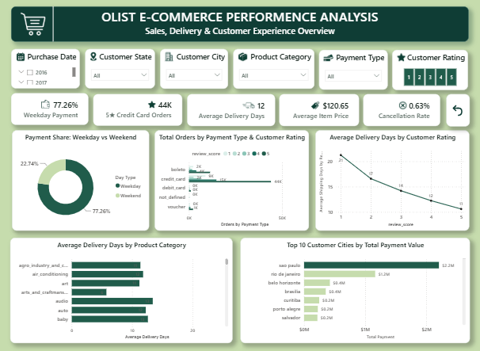

# Olist E-Commerce Performance Analysis

## Gambaran Umum

Project ini menggunakan **Olist Brazilian E-Commerce Public Dataset** untuk memperoleh insight mengenai aktivitas transaksi dan perilaku pelanggan dalam platform e-commerce.
Analisis dilakukan menggunakan alur end-to-end, dimulai dari tahap preprocessing data menggunakan Python, dilanjutkan dengan analisis dan perhitungan KPI menggunakan SQL, kemudian divisualisasikan melalui dashboard interaktif menggunakan Power BI. Kombinasi ketiga tools tersebut digunakan untuk mengolah data transaksi menjadi KPI, visualisasi, dan insight mengenai performa e-commerce, perilaku pembayaran, performa pengiriman, serta customer experience.

## Tujuan Analisis
Analisis dilakukan untuk menjawab 5 KPI utama kemudian menyajikan hasil analisis dalam bentuk dashboard Power BI yang interaktif.
- Menganalisis pola pembayaran berdasarkan transaksi weekday.
- Menghitung jumlah pesanan dengan customer rating 5 yang menggunakan credit card.
- Menghitung rata-rata waktu pengiriman dari waktu pemesanan hingga pesanan diterima pelanggan.
- Menghitung rata-rata harga item dalam dataset.
- Menghitung persentase pesanan yang dibatalkan.

Selain KPI utama, analisis SQL juga digunakan untuk mendukung beberapa visualisasi pada dashboard, meliputi:
- Orders by Payment Type & Customer Rating
- Average Delivery Days by Customer Rating
- Average Delivery Days by Product Category
- Top 10 Customer Cities by Total Payment Value

## Dashboard Overview


## Dataset

- **Sumber:** Olist Brazilian E-Commerce Public Dataset
- [View Dataset on Google Drive](https://drive.google.com/drive/folders/1TdwOwtetvXBXXdbHEJsmz5sNz0_vPcDl?hl=ID)
- **Jenis Data:** Data transaksi e-commerce
- **Cakupan:** Orders, customers, products, payments, geolocation, and reviews

Dataset terdiri dari beberapa tabel relasional yang menyediakan informasi mengenai pesanan pelanggan, produk, transaksi pembayaran, waktu pengiriman, dan customer reviews.

## Alur Analisis

```text
Raw Data
   ↓
Python Data Preprocessing
   ↓
SQL KPI Analysis
   ↓
Power BI Visualization
   ↓
Insight
```

## Tech Stack
- Python: Data preprocessing dan data transformation)
- SQL: KPI calculation dan data analysis
- Power BI: Interactive dashboard dan data visualization
